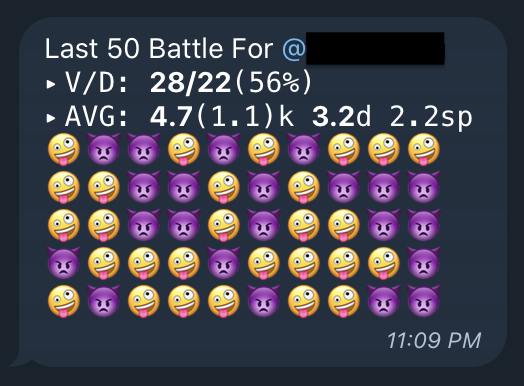
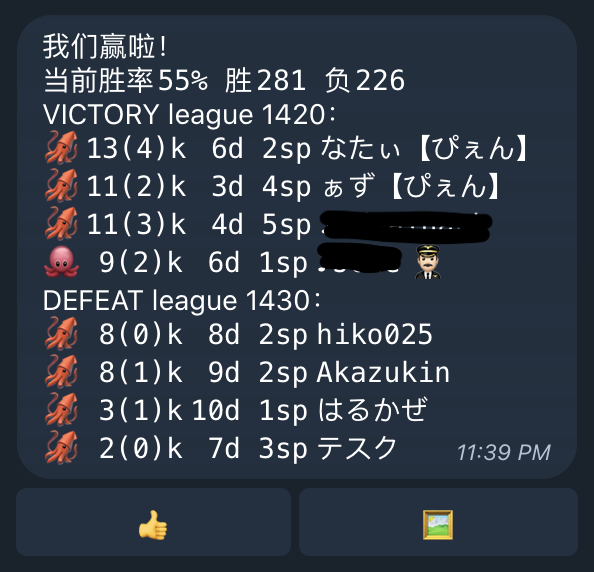

# sp2battlebot

Srouce code for [@Sp2BattleBot](https://t.me/Sp2BattleBot).

A bot for telegram. Get Splatoon2 battle info in telegram.

_* This project rewrite from [swift version](https://github.com/JoneWang/sp2battlebot-swift).*_

## Screenshot





## Start

First, install dependencies.

``` bash
pip3 install -r requirements.txt
```

Set your bot token and administrator username in config.py.

``` bash
TELEGRAM_BOT_TOKEN = ''
ADMINISTRATOR_USERNAME = ''
```

Run

```bash
./sp2battlebot [start|stop|restart]
```

## Command

/start - Start here.

/gettoken - Get token.

/settoken - Set token.

/last - Last battle info.

/last50 - Show overview for last 50 battle.

/startpush - Startup battle push.

/stoppush - Stop battle push.

/help - Show help.

## Require

* python3
